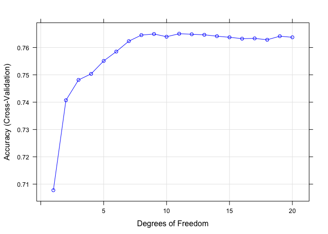
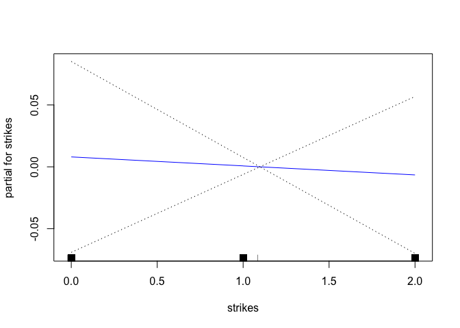
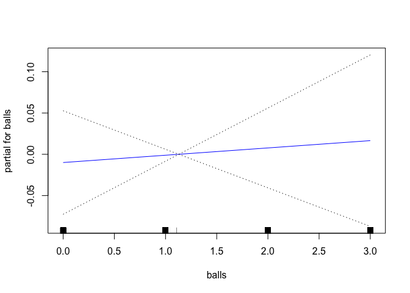
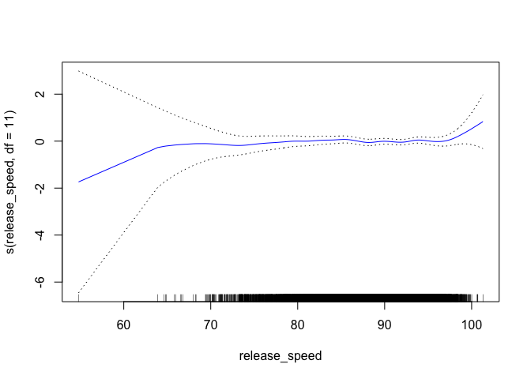
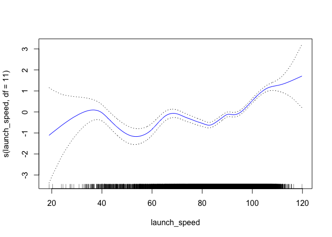
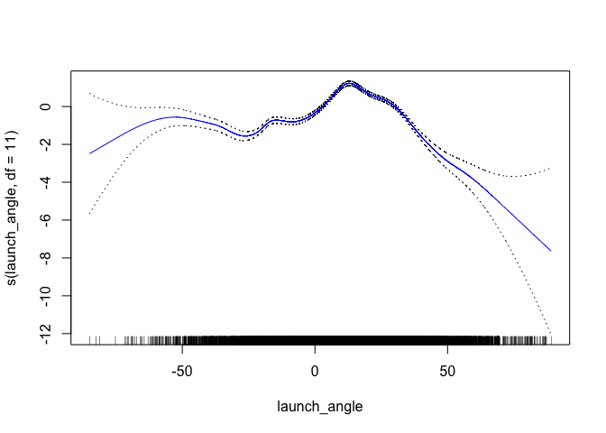

Predicting a hit with GAMs
================
Brandon Hoeft
February 25, 2018

-   [Overview](#overview)
-   [Load Statcast Dataset](#load-statcast-dataset)
-   [Basic Description of the Data](#basic-description-of-the-data)
    -   [What events do we want?](#what-events-do-we-want)
-   [Sample the data](#sample-the-data)
-   [Predictors](#predictors)
-   [Data Pre-processing](#data-pre-processing)
-   [Fit a GAM Model using Cross-Validation](#fit-a-gam-model-using-cross-validation)

Overview
--------

This writeup is being used to learn by applying generalized additive models, or GAMs for short, to MLB statcast batter data from 2017. Specifically, we'll be trying to predict whether a ball hit into play was a hit. This event can be represented a Bernoulli event, which we can model its likelihood as a function of a subset of predictors of interest about the batted ball event.

Load Statcast Dataset
---------------------

See the accompanying analysis, **statcast data with R** , on how I scraped and obtained batter data from MLB's Statcast system from much of the 2017 season. These data will be the basis of further analysis.

The data extract is currently being stored on [AWS S3](https://aws.amazon.com/s3/).

``` r
library(aws.s3)
library(feather)

# specify personal account keys as environment variables so I can read my s3 object(s) from AWS. 
# DO NOT SAVE KEY in code or render in output!!!! Could compromise AWS account. 
# Note to self my key and secret last gen from October 2017. 
#Sys.setenv("AWS_ACCESS_KEY_ID" = "",
#           "AWS_SECRET_ACCESS_KEY" = "")
# items: part number, parent, catalogue, attributes/values.

statcast17 <- s3read_using(FUN = read_feather, 
                      object = "statcast_batter_data.feather", 
                      bucket = "baseball-project")
```

Basic Description of the Data
-----------------------------

There are 79 variables in these data, and range from the gamedays of 2017-04-02 to 2017-08-19.

These data take up a lot of space on disk, specifically 3.45760910^{8}MB. As we can see by the number of rows below, it probably makes to use just a smaller subset of these data for analysis by randomly sampling from it.

``` r
library(dplyr)

glimpse(statcast17)
```

    ## Observations: 547,705
    ## Variables: 79
    ## $ pitch_type                      <chr> "FF", "CU", "CU", "CU", "FF", ...
    ## $ game_date                       <date> 2017-04-02, 2017-04-02, 2017-...
    ## $ release_speed                   <chr> "93.5", "80.5", "77.7", "77.5"...
    ## $ release_pos_x                   <dbl> 2.3760, 2.4653, 2.5595, 2.4054...
    ## $ release_pos_z                   <chr> "6.0953", "6.1044", "6.0944", ...
    ## $ player_name                     <chr> "Randal Grichuk", "Randal Gric...
    ## $ batter                          <int> 545341, 545341, 545341, 543939...
    ## $ pitcher                         <int> 543557, 543557, 543557, 543557...
    ## $ events                          <chr> "single", NA, NA, "walk", NA, ...
    ## $ description                     <chr> "hit_into_play_score", "ball",...
    ## $ spin_dir                        <lgl> NA, NA, NA, NA, NA, NA, NA, NA...
    ## $ spin_rate_deprecated            <lgl> NA, NA, NA, NA, NA, NA, NA, NA...
    ## $ break_angle_deprecated          <lgl> NA, NA, NA, NA, NA, NA, NA, NA...
    ## $ break_length_deprecated         <lgl> NA, NA, NA, NA, NA, NA, NA, NA...
    ## $ zone                            <chr> "7", "14", "9", "13", "14", "7...
    ## $ des                             <chr> "Randal Grichuk singles on a s...
    ## $ game_type                       <chr> "R", "R", "R", "R", "R", "R", ...
    ## $ stand                           <chr> "R", "R", "R", "L", "L", "L", ...
    ## $ p_throws                        <chr> "L", "L", "L", "L", "L", "L", ...
    ## $ home_team                       <chr> "STL", "STL", "STL", "STL", "S...
    ## $ away_team                       <chr> "CHC", "CHC", "CHC", "CHC", "C...
    ## $ type                            <chr> "X", "B", "S", "B", "S", "S", ...
    ## $ hit_location                    <chr> NA, NA, NA, NA, NA, NA, NA, NA...
    ## $ bb_type                         <chr> "line_drive", NA, NA, NA, NA, ...
    ## $ balls                           <int> 1, 0, 0, 3, 3, 3, 2, 1, 0, 2, ...
    ## $ strikes                         <int> 1, 1, 0, 2, 1, 0, 0, 0, 0, 2, ...
    ## $ game_year                       <int> 2017, 2017, 2017, 2017, 2017, ...
    ## $ pfx_x                           <chr> "0.7753", "-0.4186", "-0.8343"...
    ## $ pfx_z                           <chr> "1.1861", "-1.1291", "-0.9936"...
    ## $ plate_x                         <chr> "-0.5805", "0.2638", "0.8160",...
    ## $ plate_z                         <chr> "2.0028", "1.1467", "1.8012", ...
    ## $ on_3b                           <dbl> 500874, 500874, 500874, NA, NA...
    ## $ on_2b                           <dbl> 425877, 425877, 425877, 500874...
    ## $ on_1b                           <dbl> 543939, 543939, 543939, 425877...
    ## $ outs_when_up                    <int> 2, 2, 2, 2, 2, 2, 2, 2, 2, 1, ...
    ## $ inning                          <int> 9, 9, 9, 9, 9, 9, 9, 9, 9, 9, ...
    ## $ inning_topbot                   <chr> "Bot", "Bot", "Bot", "Bot", "B...
    ## $ hc_x                            <chr> "122.55", NA, NA, NA, NA, NA, ...
    ## $ hc_y                            <chr> "65.52", NA, NA, NA, NA, NA, N...
    ## $ tfs_deprecated                  <lgl> NA, NA, NA, NA, NA, NA, NA, NA...
    ## $ tfs_zulu_deprecated             <lgl> NA, NA, NA, NA, NA, NA, NA, NA...
    ## $ pos2_person_id                  <chr> "575929", "575929", "575929", ...
    ## $ umpire                          <lgl> NA, NA, NA, NA, NA, NA, NA, NA...
    ## $ sv_id                           <chr> "170403_041052", "170403_04103...
    ## $ vx0                             <lgl> NA, NA, NA, NA, NA, NA, NA, NA...
    ## $ vy0                             <lgl> NA, NA, NA, NA, NA, NA, NA, NA...
    ## $ vz0                             <lgl> NA, NA, NA, NA, NA, NA, NA, NA...
    ## $ ax                              <lgl> NA, NA, NA, NA, NA, NA, NA, NA...
    ## $ ay                              <lgl> NA, NA, NA, NA, NA, NA, NA, NA...
    ## $ az                              <lgl> NA, NA, NA, NA, NA, NA, NA, NA...
    ## $ sz_bot                          <chr> "1.5824", "1.5361", "1.4734", ...
    ## $ hit_distance_sc                 <dbl> 390, NA, NA, NA, NA, NA, NA, N...
    ## $ launch_speed                    <dbl> 109.3, NA, NA, NA, NA, NA, NA,...
    ## $ launch_angle                    <dbl> 18.1000, NA, NA, NA, NA, NA, N...
    ## $ effective_speed                 <dbl> 92.758, 78.876, 76.119, 77.071...
    ## $ release_spin_rate               <dbl> 1852, 2546, 2347, 2461, 1864, ...
    ## $ release_extension               <dbl> 6.261, 5.868, 5.905, 6.390, 6....
    ## $ game_pk                         <dbl> 490099, 490099, 490099, 490099...
    ## $ pos1_person_id                  <chr> "543557", "543557", "543557", ...
    ## $ pos2_person_id.1                <chr> "575929", "575929", "575929", ...
    ## $ pos3_person_id                  <chr> "519203", "519203", "519203", ...
    ## $ pos4_person_id                  <chr> "595879", "595879", "595879", ...
    ## $ pos5_person_id                  <chr> "592178", "592178", "592178", ...
    ## $ pos6_person_id                  <chr> "608365", "608365", "608365", ...
    ## $ pos7_person_id                  <chr> "656941", "656941", "656941", ...
    ## $ pos8_person_id                  <chr> "518792", "518792", "518792", ...
    ## $ pos9_person_id                  <chr> "450314", "450314", "450314", ...
    ## $ release_pos_y                   <chr> "54.2378", "54.6308", "54.5935...
    ## $ estimated_ba_using_speedangle   <dbl> 0.806, 0.000, 0.000, 0.000, 0....
    ## $ estimated_woba_using_speedangle <dbl> 1.178, 0.000, 0.000, 0.000, 0....
    ## $ woba_value                      <chr> "0.90", NA, NA, "0.70", NA, NA...
    ## $ woba_denom                      <chr> "1", NA, NA, "1", NA, NA, NA, ...
    ## $ babip_value                     <chr> "1", NA, NA, "0", NA, NA, NA, ...
    ## $ iso_value                       <chr> "0", NA, NA, "0", NA, NA, NA, ...
    ## $ launch_speed_angle              <chr> "6", NA, NA, NA, NA, NA, NA, N...
    ## $ at_bat_number                   <int> 80, 80, 80, 79, 79, 79, 79, 79...
    ## $ pitch_number                    <int> 3, 2, 1, 6, 5, 4, 3, 2, 1, 5, ...
    ## $ barrel                          <dbl> 1, NA, NA, NA, NA, NA, NA, NA,...
    ## $ game_day                        <chr> "2017-04-02", "2017-04-02", "2...

### What events do we want?

As mentioned before, we want to predict hits using the sample space of events where any ball was hit into play. The *description* field helps explain some of the different types of situations captured in the dataset.

``` r
statcast17 %>%
    group_by(description) %>%
    summarize(total = n()) %>%
    mutate(proportion_of_total = round(total / sum(total), 2)) %>%
    arrange(desc(total)) %>%
    kable()
```

| description               |   total|  proportion\_of\_total|
|:--------------------------|-------:|----------------------:|
| ball                      |  184531|                   0.34|
| foul                      |   95056|                   0.17|
| called\_strike            |   91419|                   0.17|
| hit\_into\_play           |   62072|                   0.11|
| swinging\_strike          |   52465|                   0.10|
| hit\_into\_play\_no\_out  |   22044|                   0.04|
| blocked\_ball             |   12813|                   0.02|
| hit\_into\_play\_score    |   12581|                   0.02|
| foul\_tip                 |    4617|                   0.01|
| swinging\_strike\_blocked |    4306|                   0.01|
| automatic\_ball           |    2539|                   0.00|
| foul\_bunt                |    1468|                   0.00|
| hit\_by\_pitch            |    1344|                   0.00|
| missed\_bunt              |     354|                   0.00|
| pitchout                  |      96|                   0.00|

It looks like our situations of interest in the *description* field are prefixed by "hit\_into". Let's check to ensure that the *events* associated with these make sense to use.

``` r
statcast17 %>%
    filter(description %in% c("hit_into_play", "hit_into_play_no_out", "hit_into_play_score")) %>%
    group_by(description, events) %>%
    summarize(total = n()) %>%
    mutate(proportion_of_total = round(total / sum(total), 2)) %>%
    arrange(description, desc(total))
```

    ## # A tibble: 37 x 4
    ## # Groups:   description [3]
    ##      description                    events total proportion_of_total
    ##            <chr>                     <chr> <int>               <dbl>
    ##  1 hit_into_play                 field_out 55157                0.89
    ##  2 hit_into_play grounded_into_double_play  2833                0.05
    ##  3 hit_into_play                 force_out  2554                0.04
    ##  4 hit_into_play                  sac_bunt   642                0.01
    ##  5 hit_into_play               double_play   314                0.01
    ##  6 hit_into_play                    single   272                0.00
    ##  7 hit_into_play       fielders_choice_out   228                0.00
    ##  8 hit_into_play                    double    54                0.00
    ##  9 hit_into_play               field_error    11                0.00
    ## 10 hit_into_play               triple_play     4                0.00
    ## # ... with 27 more rows

Having looked at the types of events, it appears the 3 *description* categories relating to balls hit into play give covereage for the types of events we want to model. The only events I'll filter out for now are "sac\_bunt" and "catcher\_interf", as neither of these really relate to hitting all that much.

Sample the data
---------------

We'll gloss over the exploratory data analysis for now, and get to modeling. First, we'll sample from the entire dataset to work with a more manageable, but representative subset for modeling the likelihood of getting a hit when the ball was batted into play.

``` r
set.seed(54321)
sample_data <- statcast17 %>%
    # hit type data and complete cases. 
    filter(description %in% c("hit_into_play", "hit_into_play_no_out", "hit_into_play_score"),
           !events %in% c("sac_bunt", "catcher_interf")) %>%
    sample_n(size = 10000, replace = FALSE) %>%
    mutate(y_hit = factor(ifelse(events %in% c("single", "double", "triple", "home_run"),
                          "yes_hit",
                          "no_hit"), levels = c("no_hit", "yes_hit")))

sample_data %>%
    group_by(y_hit) %>%
    summarize(total = n()) %>%
    mutate(average = round(total / sum(total), 3))
```

    ## # A tibble: 2 x 3
    ##     y_hit total average
    ##    <fctr> <int>   <dbl>
    ## 1  no_hit  6692   0.669
    ## 2 yes_hit  3308   0.331

We see that when the ball was hit into play for this sample of records, the batted ball landed for a hit approximately 33.1% of the time. This is the outcome we are going to target in our model.

Predictors
----------

Predictors we'll focus on for now to try and predict a hit are:

-   **release speed**: the speed of the pitch in MPH
-   **pitch type**: the type of pitch thrown.

``` r
pitch_type_summary <- sample_data %>%
    group_by(pitch_type) %>%
    summarize(total = n()) %>%
    mutate(proportion_of_total = round(total / sum(total), 2),
           less_two_percent = ifelse(proportion_of_total < .05, TRUE, FALSE)) %>%
    arrange(desc(total)) 
pitch_type_summary %>% kable()
```

| pitch\_type |  total|  proportion\_of\_total| less\_two\_percent |
|:------------|------:|----------------------:|:-------------------|
| FF          |   3420|                   0.34| FALSE              |
| FT          |   1600|                   0.16| FALSE              |
| SL          |   1513|                   0.15| FALSE              |
| CH          |   1111|                   0.11| FALSE              |
| CU          |    695|                   0.07| FALSE              |
| SI          |    624|                   0.06| FALSE              |
| FC          |    523|                   0.05| FALSE              |
| KC          |    215|                   0.02| TRUE               |
| FS          |    178|                   0.02| TRUE               |
| NA          |     60|                   0.01| TRUE               |
| KN          |     53|                   0.01| TRUE               |
| FO          |      4|                   0.00| TRUE               |
| SC          |      2|                   0.00| TRUE               |
| EP          |      1|                   0.00| TRUE               |
| IN          |      1|                   0.00| TRUE               |

``` r
rare_pitch <- pitch_type_summary[pitch_type_summary$less_two_percent == TRUE, ]$pitch_type
```

-   **p throws**: the throwing hand of the pitcher.
-   **launch speed**: the speed of the ball of the bat in MPH
-   **launch angle**: the angle of the ball's trajectory off the bat upon contact.
-   **balls**: the number of balls in the pitching count at time of event.
-   **strikes**: the number of strikes in the pitching count at time of event.

<!-- -->

    ## Observations: 10,000
    ## Variables: 8
    ## $ release_speed <chr> "84.4", "88.8", "92.2", "84.3", "89.8", "92.6", ...
    ## $ pitch_type    <chr> "CU", "CH", "FT", "CU", "SL", "SI", "FF", "FT", ...
    ## $ p_throws      <chr> "R", "R", "R", "R", "L", "R", "L", "R", "R", "R"...
    ## $ launch_angle  <dbl> -17.223, 16.099, -40.229, 17.034, 33.471, 22.889...
    ## $ launch_speed  <dbl> 53.9, 98.7, 36.8, 107.3, 84.2, 110.2, 80.0, 82.9...
    ## $ balls         <int> 1, 0, 0, 0, 3, 3, 1, 2, 2, 0, 2, 1, 3, 0, 0, 0, ...
    ## $ strikes       <int> 1, 0, 1, 1, 2, 1, 0, 0, 2, 1, 2, 2, 2, 1, 1, 0, ...
    ## $ y_hit         <fctr> no_hit, no_hit, no_hit, yes_hit, no_hit, yes_hi...

Data Pre-processing
-------------------

From glimpsing at the predictors, we notice some are not yet ready for modeling. We'll get the data ready for modeling by: handling missing data, making sure predictors are typed appropriately, and simplifiying some of the categorical predictors to be more useful by aggregating sparse categories.

``` r
modeling_data <- sample_data %>%
    select(release_speed, pitch_type, p_throws, launch_angle, launch_speed, balls, strikes, y_hit) %>%
    mutate(pitch_type_clean = ifelse(pitch_type %in% rare_pitch, "Other", pitch_type),
           release_speed = as.numeric(release_speed)) %>%
    filter(complete.cases(.)) %>% # only keep records with non-missing data. 
    select(release_speed, pitch_type_clean, p_throws, launch_angle, launch_speed, balls, strikes, y_hit, -pitch_type)
    
glimpse(modeling_data)
```

    ## Observations: 9,934
    ## Variables: 8
    ## $ release_speed    <dbl> 84.4, 88.8, 92.2, 84.3, 89.8, 92.6, 90.9, 94....
    ## $ pitch_type_clean <chr> "CU", "CH", "FT", "CU", "SL", "SI", "FF", "FT...
    ## $ p_throws         <chr> "R", "R", "R", "R", "L", "R", "L", "R", "R", ...
    ## $ launch_angle     <dbl> -17.223, 16.099, -40.229, 17.034, 33.471, 22....
    ## $ launch_speed     <dbl> 53.9, 98.7, 36.8, 107.3, 84.2, 110.2, 80.0, 8...
    ## $ balls            <int> 1, 0, 0, 0, 3, 3, 1, 2, 2, 0, 2, 1, 3, 0, 0, ...
    ## $ strikes          <int> 1, 0, 1, 1, 2, 1, 0, 0, 2, 1, 2, 2, 2, 1, 1, ...
    ## $ y_hit            <fctr> no_hit, no_hit, no_hit, yes_hit, no_hit, yes...

Fit a GAM Model using Cross-Validation
--------------------------------------

We'll use the `caret` library to develop a gam, which relies on the `gam` library.

We'll use five-fold cross-validation. Additionally, for the `df` hyperparameter, "degrees freedom", we'll pass a grid of integer values. This model is using Hastie's package `GAM`. GAMs under this package are fit with smoothing splines. Hastie's book, [ISLR](http://www-bcf.usc.edu/~gareth/ISL/) explains these in detail. The effective degrees freedom or the *λ* (lambda) parameter, penalizes the flexibility of each smoothing function for every x.

*λ* measures the total change in the smoothing function (the 2nd derivative) over the range of x. Small values of *λ* will allow for very flexible curves (low bias, high variance). Higher values of *λ* create flatter, smooth curves that approach a line (high bias, low variance). The goal is to find the best form of the smoother function that balances bias-variance tradeoff.

*λ* = 0: no penalty. the smoother function fits the Y ~ x relationship perfectly. *λ* &gt; 0: higher penalty. increasingly larger values make the function fit the Y ~ x relationship more smoothly.

``` r
library(caret)
library(gam)

training_setup <- trainControl(method = "cv",
                               number = 5, #10-fold CV
                               savePredictions = TRUE,
                               classProbs = TRUE) 

degrees_freedom_grid = data.frame(df = seq(1, 20, by = 1))

set.seed(2018)
GAM_fit <- train(x = modeling_data[1:7],
                 y = modeling_data$y_hit,
                 method = 'gamSpline',
                 trControl = training_setup,
                 metric = "ROC",
                 tuneGrid = degrees_freedom_grid)
GAM_fit
```

    ## Generalized Additive Model using Splines 
    ## 
    ## 9934 samples
    ##    7 predictor
    ##    2 classes: 'no_hit', 'yes_hit' 
    ## 
    ## No pre-processing
    ## Resampling: Cross-Validated (5 fold) 
    ## Summary of sample sizes: 7948, 7947, 7947, 7947, 7947 
    ## Resampling results across tuning parameters:
    ## 
    ##   df  Accuracy   Kappa    
    ##    1  0.7077707  0.2335869
    ##    2  0.7406882  0.3570811
    ##    3  0.7481372  0.3912402
    ##    4  0.7503527  0.4043510
    ##    5  0.7550838  0.4205229
    ##    6  0.7585065  0.4327442
    ##    7  0.7623315  0.4437055
    ##    8  0.7645461  0.4503964
    ##    9  0.7649489  0.4514261
    ##   10  0.7639422  0.4491903
    ##   11  0.7650495  0.4512285
    ##   12  0.7648483  0.4500004
    ##   13  0.7646468  0.4483616
    ##   14  0.7641434  0.4470345
    ##   15  0.7637406  0.4458991
    ##   16  0.7632373  0.4447499
    ##   17  0.7633379  0.4451836
    ##   18  0.7628343  0.4436894
    ##   19  0.7641429  0.4462638
    ##   20  0.7637402  0.4453441
    ## 
    ## Accuracy was used to select the optimal model using the largest value.
    ## The final value used for the model was df = 11.

``` r
plot(GAM_fit, se = TRUE, col = "blue")
```



We can also plot the relationship identified by the best GAM final fit model.

``` r
plot(GAM_fit$finalModel, se = TRUE, col = "blue", all.terms = TRUE)
```


